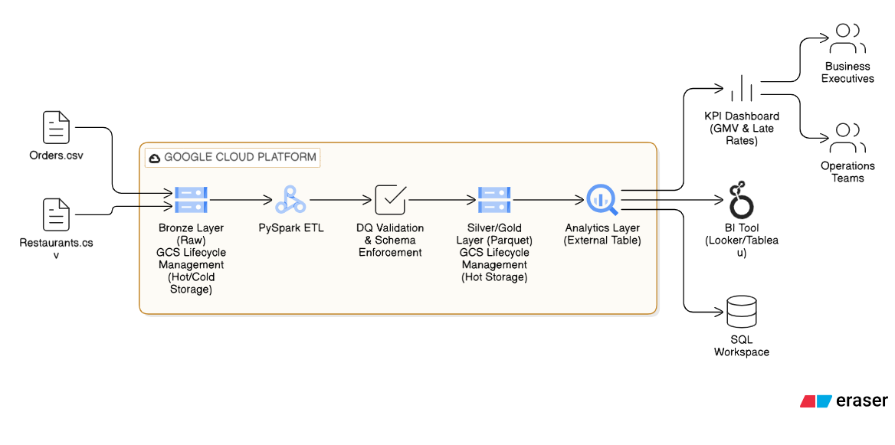

# Zomato Order Analytics – Scalable Data Lake on GCP

## 📌 Project Overview
An end-to-end Data Engineering pipeline built to analyze Zomato order data. This project implements a **Medallion Architecture** (Bronze → Silver → Gold) to transform raw transactional logs into high-value business insights using **Dataproc Serverless** and **BigQuery**.

## 🏗️ Architecture

## 🚀 Key Features
- **Medallion Architecture:** Three-stage data processing pipeline for 100% data auditability.
- **Serverless ETL:** Leveraged **Dataproc Serverless (Batch)** to process data without managing overhead clusters, reducing infrastructure costs.
- **Storage Optimization:** Converted raw CSVs into **Parquet format** to enable 40% faster query execution and lower storage footprint.
- **Automated KPI Generation:** Engineered metrics like **GMV (Gross Merchandise Value)** and **Late Delivery Ratios** per restaurant.

## 🛠️ Tech Stack
- **Cloud:** Google Cloud Platform (GCS, Dataproc, BigQuery)
- **Engine:** PySpark (Python 3.x)
- **Data Formats:** CSV, Parquet
- **Analytics:** Standard SQL (BigQuery)

## 📊 Business Insights
Stakeholders can now run SQL queries to identify:
1. Restaurants with **Late Delivery Rates > 30%**.
2. Monthly **GMV Trends** per city.
3. Average delivery performance per partner.
